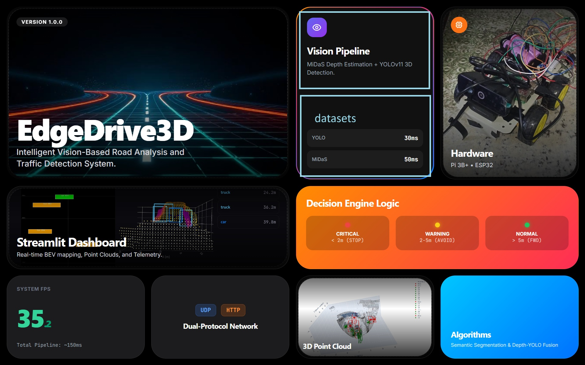
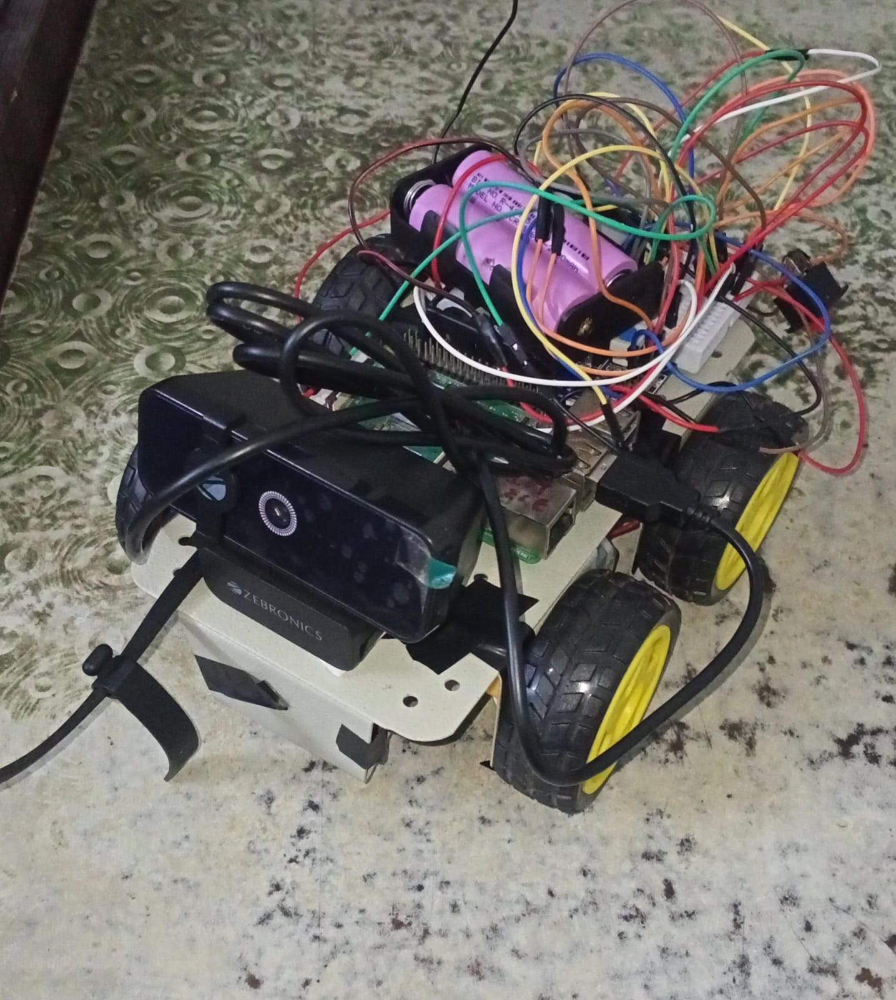
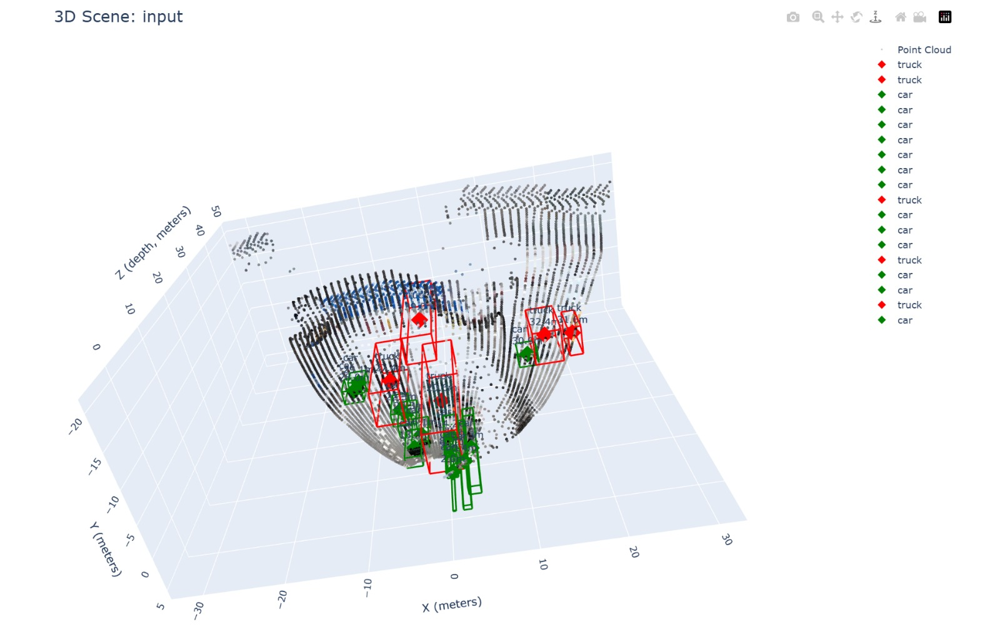
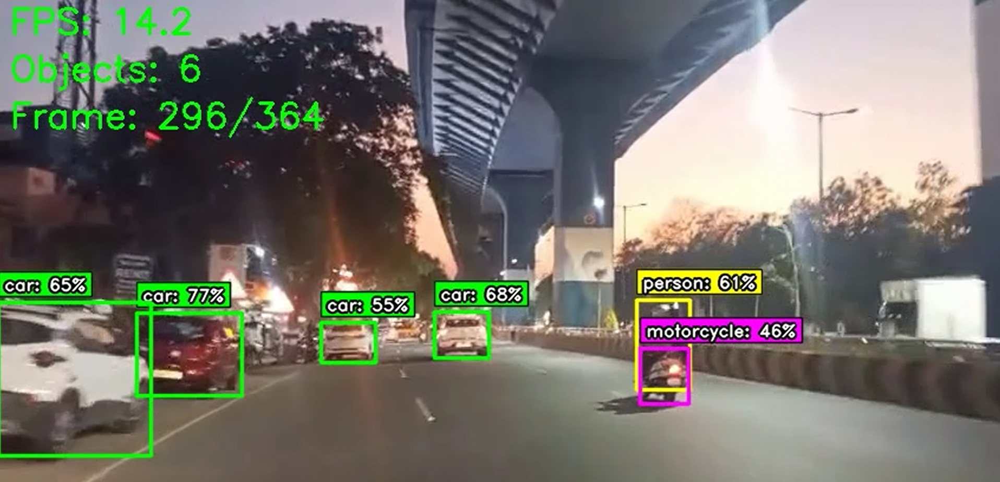

# Intelligent Autonomous Robot Car System

An end-to-end **autonomous navigation platform** that fuses computer vision, GPS waypoint navigation, real-time obstacle avoidance, a decision engine, a digital twin, and remote control into a single distributed system. The "brain" runs on a laptop (YOLOv8 + sensor fusion), a **Raspberry Pi 5** streams camera video, and **two ESP32** boards handle motor control and ultrasonic sensing — all communicating over Wi-Fi.

> Built as a full hardware + software systems project: edge robotics, real-time perception, multi-device networking, and web/3D dashboards.

---

## Demo & Screenshots

| Live Dashboard | Hardware Prototype | 3D Perception |
|---|---|---|
|  |  |  |

| Object Detection |
|---|
|  |

> **Demo video:** _Add a YouTube/Drive link here_ — the raw `.mp4` clips are intentionally kept out of the repo (see [Large files](#large-files-not-in-this-repo)).

---

## Key Features

- **Autonomous Navigation** — GPS waypoint following with live obstacle avoidance
- **Real-Time Perception** — YOLOv8 object detection on a video stream from the Pi, plus ultrasonic ranging and sensor fusion
- **Decision Engine** — rule-based, priority-weighted arbitration (safety overrides → mode tasks → navigation)
- **11+ Operating Modes** — follow-me, guidance, summon, delivery, escort, ambulance priority, auto-park, crash response, elder/hospital assist, medical delivery
- **Digital Twin** — live 3D virtual replica synchronized with the physical robot
- **3D Mapping** — monocular depth → point cloud + Bird's-Eye-View reconstruction
- **Remote Control** — Telegram bot (`/status`, `/photo`, `/goto`, `/mode`, ...) + web dashboards
- **GPS & Campus Dashboards** — Flask + Three.js / React 3D map visualizations

---

## System Architecture

```
                         Wi-Fi (shared network)
        ┌───────────────┬───────────────────┬────────────────┐
        ▼               ▼                   ▼                ▼
  ┌───────────┐  ┌──────────────┐   ┌──────────────┐  ┌──────────────┐
  │  ESP32 #1 │  │   ESP32 #2   │   │ Raspberry Pi5│  │    Phone     │
  │ Motor Ctrl│  │ Ultrasonic   │   │ Camera Sender│  │ (Telegram)   │
  │ 2×TB6612  │  │ HC-SR04      │   │ JPEG/UDP     │  │              │
  └─────┬─────┘  └──────┬───────┘   └──────┬───────┘  └──────┬───────┘
        │ UDP:9000      │ UDP:9002         │ UDP:5000        │
        └───────────────┴─────────┬────────┴─────────────────┘
                                   ▼
                  ┌──────────────────────────────────┐
                  │        LAPTOP  (the Brain)        │
                  │  YOLOv8 detection + sensor fusion │
                  │  Decision engine → motor commands │
                  │  Dashboards / Digital Twin / Bot  │
                  └──────────────────────────────────┘
```

**New here?** Start with the **[System Architecture](docs/SYSTEM_ARCHITECTURE.md)** — it
has rendered diagrams of the control loop, decision engine, and modes, plus design rationale.
Full spec (ports, pinouts, protocols, state model) is in **[docs/final_project_description.md](docs/final_project_description.md)**.

---

## Repository Structure

```
.
├── main.py / main_complete.py / main_intelligent.py   # Entry points / orchestration
├── requirements.txt
├── config/                 # settings.py, gps_settings.py
├── core/                   # perception_engine, lane_detector, sign_detector
├── hardware/               # gps_reader (NMEA), pi_sender, hardware_integration, hardware.ino
├── utils/                  # coordinate transforms & helpers
├── dashboard/              # Streamlit perception dashboard
├── dashboards/
│   └── gps_secondary/      # GPS / 3D map dashboards (Flask)
├── FINAL_DASHBOARD/        # CIT-ADAS dashboard + 3D-nav server + ESP32 Wi-Fi GPS
├── visualization_3d/       # 3D scene renderer + .glb asset library
├── 3d_mapping/             # Depth → point cloud → BEV pipeline (av_3d_mapping, _3d_mapping)
├── digital_twin/           # Flask + WebSocket twin server, hardware sync bridge, route simulator
├── telegram_bot/           # Remote command-and-control bot
├── modes/                  # Web app for the 11 operating modes (HTML/JS/CSS)
├── firmware/               # ESP32 sketches: motor controller, ultrasonic, check_motors
├── GPS_DASH/               # GPS sub-system: campus 3D React dashboard, camera 3D map,
│                           #   path simulation, serial/wifi tests, Node backend
├── tests/                  # Integration tests
└── docs/                   # Full documentation, diagrams, screenshots (docs/images/)
```

---

## Tech Stack

**Perception / ML:** Python, OpenCV, Ultralytics YOLOv8, PyTorch, Open3D, MiDaS-style depth
**Backend / Dashboards:** Flask, Flask-SocketIO, Streamlit, Plotly, Folium (OpenStreetMap)
**Frontend / 3D:** React + Vite, Three.js / react-three-fiber, vanilla JS 3D
**Embedded / Hardware:** ESP32 (Arduino/PlatformIO), Raspberry Pi 5, HC-SR04, 2× TB6612FNG, GPS (NMEA)
**Comms:** UDP video + command streams, HTTP/WebSocket, Telegram Bot API

---

## Getting Started

### 1. Python brain + dashboards
```bash
pip install -r requirements.txt

# Run the main pipeline (laptop brain)
python main.py

# Or launch the Streamlit dashboard
streamlit run dashboard/app.py
```
YOLOv8 weights (`yolov8n.pt` / `yolov8m.pt`) download automatically via `ultralytics` on first run.

### 2. Firmware (ESP32)
Open the sketches in `firmware/` with Arduino IDE or PlatformIO, set your Wi-Fi SSID/password
(placeholders are in the `.ino` files), and flash:
- `firmware/esp32_motor_controller/` — motor driver + command receiver
- `firmware/esp32_ultrasonic_udp_v1/` — HC-SR04 distance sender

### 3. Telegram bot (optional)
```bash
cd telegram_bot
cp .env.example .env        # add your bot token + admin id
pip install -r requirements.txt
python telegram_bot_main.py
```

### 4. GPS / campus 3D dashboard (optional)
```bash
cd GPS_DASH/campus_3d_dashboard
npm install
npm run dev
```

---

## Operating Modes

Selectable from the web UI (`modes/index.html`), the Telegram bot, or automatically by the decision
engine based on context (GPS zone, detected person/crash, scheduled task):

`follow-me` · `guidance` · `summon` · `delivery` · `escort` · `ambulance priority` ·
`auto-park` · `crash response` · `elder assist` · `hospital assist` · `medical delivery`

---

## Hardware (Bill of Materials)

| Component | Role |
|---|---|
| Raspberry Pi 5 + camera | Streams 640×480 JPEG video over UDP |
| 2× ESP32 dev boards | #1 motor control, #2 ultrasonic sensing |
| 2× TB6612FNG drivers, 4× DC motors | Differential (skid-steer) drive |
| HC-SR04 ultrasonic | Close-range obstacle detection |
| USB GPS module (NMEA) | Position / waypoint navigation |
| Laptop (GPU recommended) | YOLOv8 + decision engine + dashboards |

Pinout and wiring tables: **[docs/final_project_description.md](docs/final_project_description.md)** and **[docs/pinout_diagram.html](docs/pinout_diagram.html)**.

---

## Large files (not in this repo)

To keep the repo lightweight and cloneable, these are **git-ignored** and should be hosted externally:
- **YOLO weights** (`*.pt`) — auto-downloaded by `ultralytics`
- **Demo videos** (`*.mp4`) — link them in the [Demo](#demo--screenshots) section above
- **`node_modules/`** — restored via `npm install`

---

## Documentation

The `docs/` folder contains the full project documentation, including:
- `final_project_description.md` — authoritative system spec (architecture, protocols, pinouts)
- `DECISION_ENGINE_SUMMARY.md`, `LANE_DETECTION_PIPELINE.md`, `TECHNICAL_SPECS.md`
- `ARCHITECTURE.md` + interactive `ARCHITECTURE_FLOWCHART.html`
- `bento.html`, `final_project_description.html`, `PROTOTYPE SIMULATION.html` (visual writeups)

---

## License

Released under the [MIT License](LICENSE).
