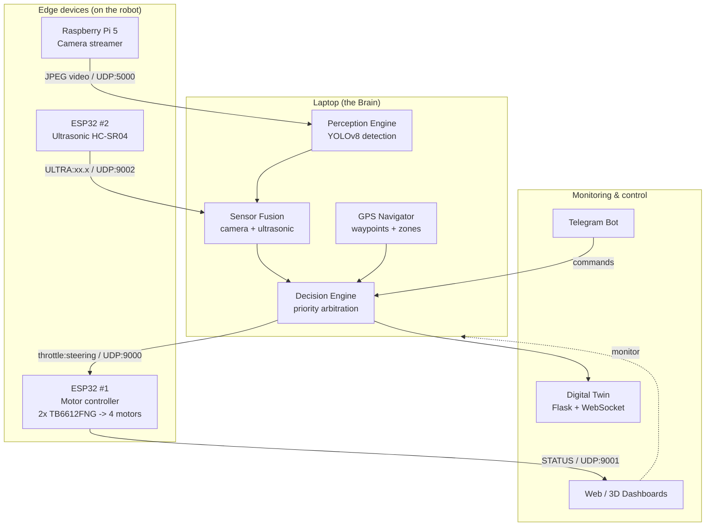
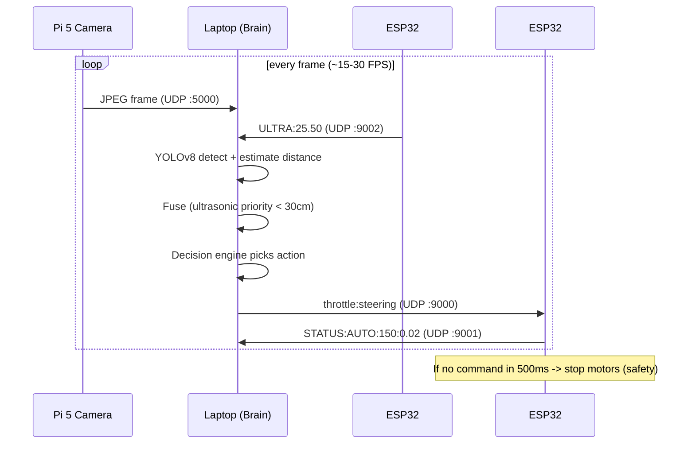
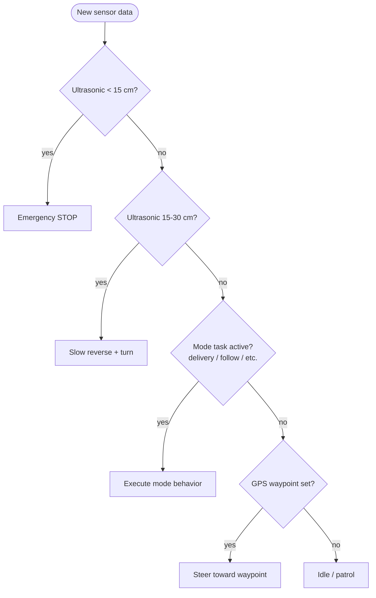
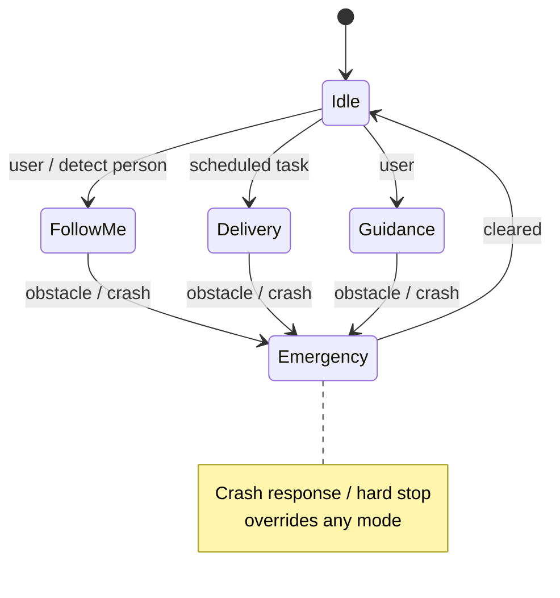

# System Architecture

A readable walkthrough of how the **Intelligent Autonomous Robot Car System** works, the design
decisions behind it, and the data that flows between parts. Diagrams below render automatically on
GitHub (Mermaid).

---

## 1. The 30-second pitch

> A robot car drives itself. A **Raspberry Pi 5** streams camera video to a **laptop**, which runs
> **YOLOv8** object detection and fuses it with an **ultrasonic distance sensor**. A **decision engine**
> turns that understanding into `throttle:steering` commands sent over Wi-Fi (UDP) to an **ESP32** that
> drives the motors. A second ESP32 reads the ultrasonic sensor. On top of this core loop sit a
> **GPS waypoint navigator**, a **Telegram bot** for remote control, a **digital twin** for live 3D
> monitoring, and several **dashboards**.

The headline idea: **split the work by where it's cheapest to run.** Heavy ML on the laptop (GPU),
real-time motor timing on microcontrollers, video capture on the Pi. They cooperate over plain UDP.

---

## 2. High-level architecture

---

## 3. Components & responsibilities

| Component | Runs on | Responsibility | Code |
|---|---|---|---|
| Camera streamer | Raspberry Pi 5 | Capture 640×480, JPEG-compress, UDP-send | (Pi side) |
| Perception engine | Laptop | YOLOv8 detection + bbox distance estimate | `core/perception_engine.py` |
| Sensor fusion | Laptop | Merge camera + ultrasonic; ultrasonic wins < 30 cm | `core/perception_engine*.py` |
| Decision engine | Laptop | Priority arbitration → motor command | `main*.py` + decision logic |
| GPS navigator | Laptop | Waypoint following, geofenced zones | `hardware/gps_reader.py`, `config/gps_settings.py` |
| Motor controller | ESP32 #1 | PWM motor drive, 500 ms command timeout | `firmware/esp32_motor_controller/` |
| Ultrasonic sensor | ESP32 #2 | HC-SR04 distance, send to laptop | `firmware/esp32_ultrasonic_udp_v1/` |
| Digital twin | Laptop | Live 3D mirror of robot state | `digital_twin/` |
| Telegram bot | Laptop/Pi | Remote commands (`/status`, `/photo`, `/goto`...) | `telegram_bot/` |
| Dashboards | Laptop | GPS map, telemetry, 3D scene | `dashboard/`, `dashboards/`, `GPS_DASH/` |

**One-line mental model:** *sense (Pi + ultrasonic) → think (laptop perception + decision) → act (ESP32 motors)*, with GPS for "where to go" and the bot/dashboards/twin for "humans watching and steering."

---

## 4. Data flow — the core control loop

**Why this matters:** it shows a *closed feedback loop* with a *safety fallback*
(the ESP32 stops itself if the laptop goes quiet). That timeout is a deliberate fail-safe.

---

## 5. Network & ports (memorize this table)

| Link | Port | Protocol | Payload |
|---|---|---|---|
| Pi → Laptop | 5000 | UDP | `[4-byte size][JPEG]` video |
| Laptop → ESP32 #1 | 9000 | UDP | `throttle:steering` (e.g. `150:0.00`) |
| ESP32 #1 → Laptop | 9001 | UDP | `STATUS:mode:throttle:steering:batt` |
| ESP32 #2 → Laptop | 9002 | UDP | `ULTRA:25.50` (cm) |
| Browser → ESP32 #1 | 8080 | HTTP | manual test web UI |
| Laptop → Browser | 5000 | HTTP | Flask dashboard |

**Why UDP, not TCP?** Video and sensor readings are *high-rate and disposable* — a dropped frame is
fine, and we never want head-of-line blocking or retransmit lag in a real-time control loop.

---

## 6. Decision engine — priority arbitration

Safety always wins. The engine checks the most dangerous condition first and only falls through to
"nice to have" behaviors (navigation, patrol) when nothing urgent is happening. This is **priority-based
arbitration** — a common, defensible robotics design.

---

## 7. Operating modes — state machine

11 modes total (follow-me, guidance, summon, delivery, escort, ambulance priority, auto-park, crash
response, elder assist, hospital assist, medical delivery). All of them yield to the **Emergency**
override — same "safety first" principle as the decision engine.

---

## 8. Tech stack & why

| Layer | Tech | Why this choice |
|---|---|---|
| Detection | YOLOv8 (Ultralytics) | Fast, accurate, pretrained on COCO (person/car/etc.) |
| Vision runtime | OpenCV + PyTorch | Standard, GPU-accelerated |
| Depth / 3D | Monocular depth + Open3D | 3D scene from a single cheap camera (no LiDAR needed) |
| Dashboards | Flask, Streamlit, React + Three.js | Flask/Streamlit = fast Python web; Three.js = real 3D in browser |
| Embedded | ESP32 (Arduino/PlatformIO) | Cheap, Wi-Fi built-in, hard-real-time PWM |
| Comms | UDP (+ HTTP/WebSocket) | Low-latency streaming; HTTP/WS for human-facing UIs |
| Remote | Telegram Bot API | Free, works anywhere, no custom app needed |

---

## 9. Key design decisions & trade-offs

1. **Distributed processing.** *Decision:* run ML on the laptop, not the Pi/ESP32.
   *Trade-off:* adds network latency, but the Pi/ESP32 can't run YOLOv8 in real time. Worth it.
2. **UDP for the control loop.** Prioritizes freshness over reliability — correct for streaming control.
3. **Sensor fusion with ultrasonic priority < 30 cm.** Cameras misjudge very close distances; the
   ultrasonic is more reliable up close, so it overrides there.
4. **Command timeout on the ESP32 (500 ms).** The microcontroller fails *safe* on its own if the brain
   or network dies — control logic lives where the motors are for the last line of defense.
5. **Digital twin separate from control.** Monitoring never blocks the real-time loop.

---

## 10. Frequently asked design questions

- *"Walk me through what happens from camera to motor."* → use the §4 sequence diagram.
- *"Why split across three devices?"* → §9.1 distributed processing.
- *"How do you avoid crashing if Wi-Fi drops?"* → ESP32 500 ms timeout + auto-reconnect (§4, §9.4).
- *"Camera says clear but the sensor says blocked — who wins?"* → ultrasonic under 30 cm (§9.3).
- *"How does it choose what to do each frame?"* → priority arbitration flowchart (§6).
- *"How would you scale / what's next?"* → LiDAR fusion, path re-planning, multi-robot mesh (roadmap).

---

*See [`final_project_description.md`](final_project_description.md) for the exhaustive spec
(pinouts, full protocol formats, twin state model, BOM).*
